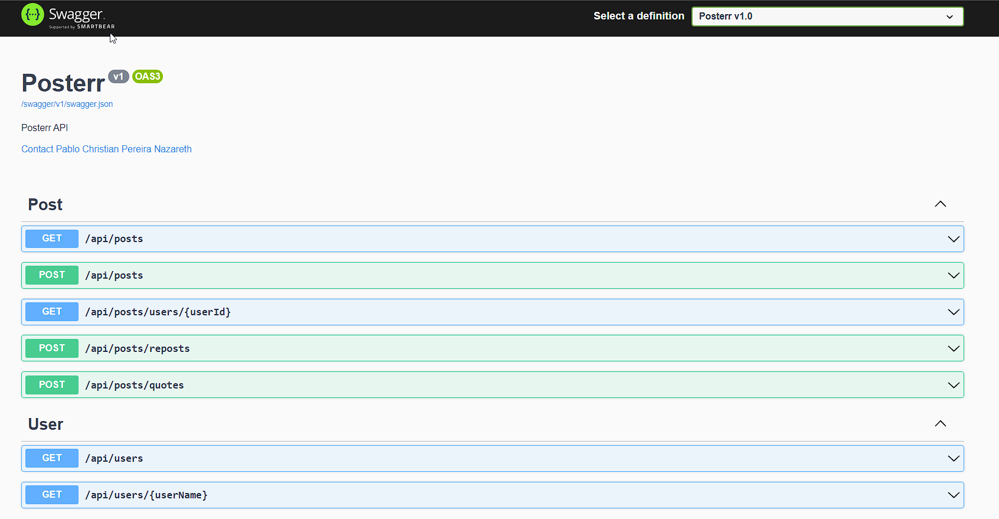
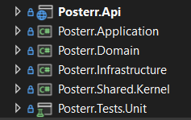

<h1 align="center">
⭐ Social Media API ⭐ 
</h1>
💬 A Social Media API application using C# dotnet. This is a coding challenge.

## 👨‍💻 Code Challenge

#### 📌 Overview
The Project Manager you work with wants to build a new product, a new social media application called Posterr. Posterr is very similar to Twitter, but it has far fewer features.
Posterr only has two pages, the homepage, and the user profile page, which are described below. Other data and actions are also detailed below.

#### ✏️ Pages

###### Home Page
<ul>
	<li>✔ The homepage, by default, will show a feed of posts (including reposts and quote posts), starting with the latest 10 posts. Older posts are loaded on-demand on chunks of 10 posts whenever the user scrolling reaches the bottom of the page.</li>
	<li>✔ There is a toggle switch "All / Only mine" that allows you to switch between seeing all posts and just posts you wrote. For both views, all kinds of posts are expected on the feed (original posts, reposts, and quote posts).</li>
	<li>✔ There is a date range filter option (start date and end date) that allows results filtering based on the posted date, both values are optional: e.g user may want to filter only posts after a certain date without defining a limit date.</li>
	<li>✔ New posts can be written from this page.</li>
</ul>

###### User profile page
<ul>
	<li>✔ Shows data about the user:
	    - Username
		- Date joined Posterr, formatted as such: "March 25, 2021"
		- Count of number of posts the user has made (including reposts and quote posts)
	</li>
	<li>✔ Shows a feed of the posts the user has made (including reposts and quote posts), starting with the latest 5 posts. Older posts are loaded on-demand when the user clicks on a button at the bottom of the page labeled "show more".</li>
	<li>✔ New posts can be written from this page: for this assessment, when writing a post from the profile screen, the profile user should be set as the author of the new content.</li>
</ul>

#### More Details

###### Users
<ul>
	<li>✔ Only alphanumeric characters can be used for username</li>
	<li>✔ Maximum 14 characters for username</li>
	<li>✔ Usernames should be unique values</li>
	<li>✔ Do not build authentication</li>
	<li>✔ Do not build CRUD for users (registration and sign-in will be handled by a different service, the user model should be part of your data modeling tho. You can seed the database with 4 users to help the reviewer demo your solution)</li>
	<li>✔ When/if necessary to make your application function, you may hard-code the user. For example, you may need to do this to implement creating new posts.</li>
</ul>

###### Posts
Posts are the equivalent of Twitter's tweets. They are text-only, user-generated content. Users can write original posts and interact with other users' posts by reposting or quote-posting. For this project, you should implement all three — original posts, reposts, and quote-posting
<ul>
	<li>✔ A user is not allowed to post more than 5 posts in one day (including reposts and quote posts)</li>
	<li>✔ Posts can have a maximum of 777 characters</li>
	<li>✔ Users cannot update or delete their posts</li>
	<li>✔ Reposting: Users can repost other users' posts (like Twitter Retweet), limited to original posts and quote posts (not reposts)</li>
	<li>✔ Quote-post: Users can repost other user's posts and leave a comment along with it (like Twitter Quote Tweet) limited to original and reposts (not quote-posts)</li>
</ul>

## 📑 Demonstrations
Swagger documentation showing the application API routes:

## 💻 Technologies and Patterns
These are all the technologies and patterns used to develop this application
##### BackEnd
- [C# .NET 6.0 Web API](https://dotnet.microsoft.com/en-us/download/dotnet/6.0)
- [MediatR](https://www.nuget.org/packages/MediatR)
- [FluentValidation](https://www.nuget.org/packages/FluentValidation)
- [AutoMapper](https://www.nuget.org/packages/AutoMapper)
- [Xunit](https://www.nuget.org/packages/xunit)
- [FluentAssertions](https://www.nuget.org/packages/FluentAssertions)
- [Moq](https://www.nuget.org/packages/Moq)

Patterns and Techniques:
- TDD (Test Driven Development)
- DDD (Domain Driven Design)
- CQRS (Command Query Responsibility Segregation)
- Middlewares: Error, Request and Response
- Dependency Injection
- Repository Pattern
- Unit of Work Pattern
- Domain Notification
- Domain Message
- Domain Exception
- Domain Helper

## 🛠 Architecture
The project solution was based on DDD (Domain Driven Design) concept.

## Requirements
I recommend following the option 01, so you wont need to install and run all the other tools needed for the project to work.

**Option 01: Run in Containers** 
To run the local application in containers, you will need to download and install the following:
- [Docker Desktop](https://docs.docker.com/desktop/#download-and-install)
- [Docker Compose](https://docs.docker.com/compose/install/compose-desktop/)

**Option 02: Outside Containers** 
If you want to run the project outside containers, you must also have the following:
- [.NET 6.0](https://dotnet.microsoft.com/en-us/download/dotnet/6.0)
- [SQLServer](https://www.microsoft.com/pt-br/sql-server/sql-server-downloads)

## ⚙️ Executing the Project
To execute the project, follow the steps below:

#### Execution

**Option 01: Run in Containers**
1. Run Docker Desktop.
2. Open the command prompt (cmd), navigate inside the project "\src" folder, and type: "docker-compose build" to build the containers (this is only necessary the first time).
3. Type "docker-compose up -d" to start the application containers.
4. To view the Web Api Swagger documentation and execute all the actions, navigate to http://localhost:8082/swagger

to stop the execution of the containers, type "docker-compose down"

**Option 02: Outside Containers**
1. Run SQLServer(port 1435).
2. Open the command prompt (cmd), navigate inside the project "\src" folder, and type: "run.bat"
3. This script will run the projects and open the browsers.

#### Testing
1. There is already a seed of usernames created and to be used on posts: test1, test2, test3, test4
2. When using date start or date end filter, the pattern must be yyyy-MM-dd

## 🤝 Critique
This section is used to self-critique to reflect and write what would be good to improve over time:

1. Performance:
	1. Cache service to store the lattest requests and posts for better performance.
2. Scalability:
	1. Decouple the message system using RabbitMQ to create all the new posts, reposts and quotes.
	2. Use of AWS ECS (Elastic Container Service) or EKS (Elastic Kubernetes Service) to manage the Docker Containers.
	3. Use of AWS Auto Scaling to manage scalability of instances by CPU usage. (Above 70% CPU usage would create new instance).
3. Load Balancing:
    1. Use of AWS Load Balancer to balance the requests between the containers (active instances).
4. Security:
	1. Use of .NET Identity to manage user authentication for security.
	2. Implement token JWT and use of claims to manager user permissions.
5. Tests
	1. Implement remaining tests left for the other classes.
	2. Implement integration tests to test end-to-end requests.
	3. Implement K6 to execute load tests so we can monitor our application to see if its going to be able to handle the expected number of users and requests per second.
	